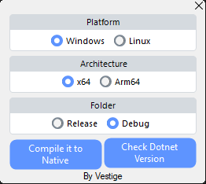

# NativeHelper
## Features
- Simple GUI for selecting build configurations.
- Supports Native AOT deployment for enhanced performance.
- Automatic handling of compiler setup and execution.
- Provides options for different architectures and platforms.
- Displays .NET version information.
# 
